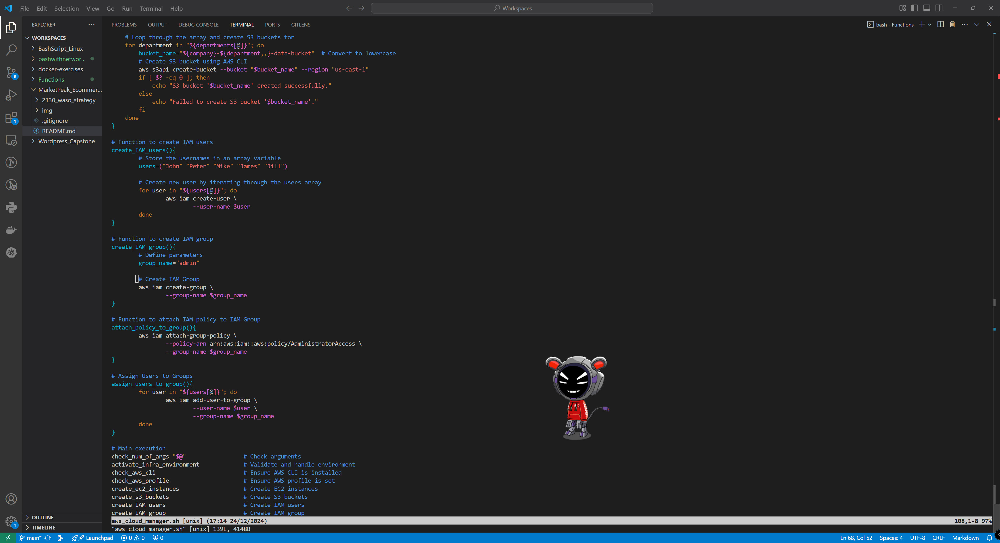

# CAPSTONE PROJECT - LINUX ADMINISTRATION AND SHELL SCRIPTING

The aim of this project is to provision resources on AWS. The list of resources are:

- IAM Users
- IAM Group
- Attach Administrative Policy to Group
- Assign Users to Group

## Create IAM users using Arrays

Here I created  5 users using an array and a for loop to iterate through the list of users.

code:
```
create_IAM_users(){
        # Store the usernames in an array variable
        users=("John" "Peter" "Mike" "James" "Jill")

        # Create new user by iterating through the users array
        for user in "${users[@]}"; do
                aws iam create-user \
                        --user-name $user
        done
}
```




## Create IAM Group

Next, I created a group called admin.

code:
```
# Function to create IAM group
create_IAM_group(){
        # Define parameters
        group_name="admin"

        # Create IAM Group
        aws iam create-group \
                --group-name $group_name
}
```


## Attach IAM Policy to IAM Group

To provide the group with certain admin permissions, I attached the policy to the created admin group.

code:
```
# Function to attach IAM policy to IAM Group
attach_policy_to_group(){
        aws iam attach-group-policy \
                --policy-arn arn:aws:iam::aws:policy/AdministratorAccess \
                --group-name $group_name
}
```


## Assign Users to Admin Group

Next, I needed to add the users to the admin group to provide them with admin priviledges provisioned to the group.

code:
```
# Assign Users to Groups
assign_users_to_group(){
        for user in "${users[@]}"; do
                aws iam add-user-to-group \
                        --user-name $user \
                        --group-name $group_name
        done
}
```


## AWS Console Results

### Created Users on Console


### Created Admin Group


### Users assigned to Groups


